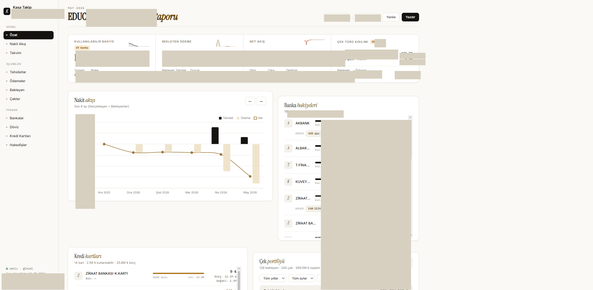
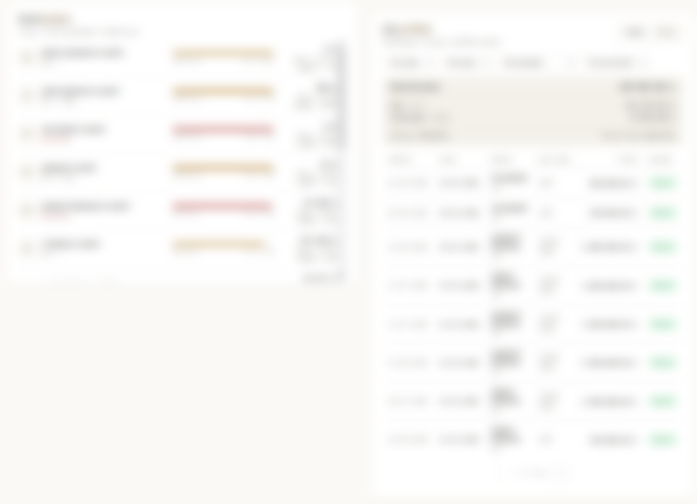
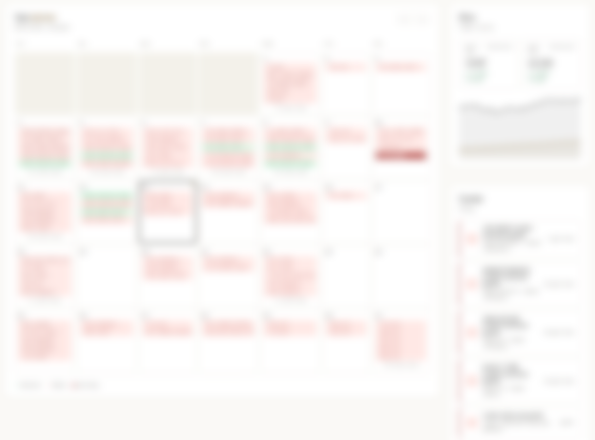
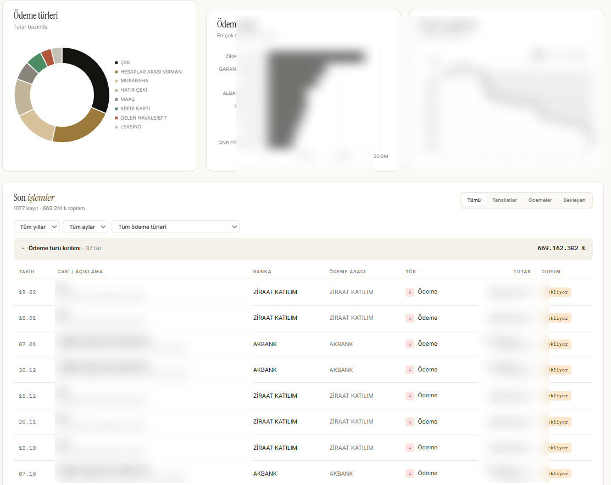

# Kasa Takip Dashboard

Kurumsal kasa, banka bakiyesi ve döviz kuru hareketlerini izleyen **gerçek zamanlı, çok-PC dağıtık dashboard**. Tek bir paylaşımlı Excel dosyasını (`xlsm`) kaynak olarak kullanır; muhasebe ekibi dosyayı kaydeder, ağdaki tüm bilgisayarlarda açık dashboard otomatik güncellenir.

Gerçek bir iş ihtiyacı için yapıldı: muhasebe Excel'de kayıt tutuyor, yönetim canlı bakiye/akış görmek istiyor ama herkesin Excel'i açıp kapatması verimsiz ve birden fazla kullanıcı aynı anda açamıyor. Bu uygulama Excel'i tek doğruluk kaynağı olarak korurken, üzerine canlı görselleştirme katmanı ekler.

**No-build, no-framework:** tek Python sunucusu + tek HTML dosyası. Vanilla JS + Chart.js. Frontend için npm/webpack/vite yok.

## Ekran görüntüleri

> Çalışan dashboard'dan alınan ekran görüntüleri; finansal veriler gizlilik için bulanıklaştırılmıştır. Tasarım ve layout görünürdür.

**Özet ekranı** — KPI'lar, nakit akışı, banka bakiyeleri



**Kredi kartları ve çek portföyü** — limit/borç oranı, çek vade listesi



**Vade takvimi ve uyarılar** — günlük işlem yoğunluğu, gecikmiş kredi kartı uyarıları



**Ödeme analizi ve son işlemler** — ödeme türü dağılımı, en çok kullanılan banka, ay karşılaştırma, işlem tablosu



## Mimari

```
              ┌─────────────────────────┐
              │  Paylaşımlı Network     │
              │  Drive (SMB/UNC)        │
              │                         │
              │  Kasa_Takip.xlsm        │◀── Muhasebe kaydediyor
              │  stop.flag (signal)     │
              │  restart.flag (signal)  │
              └────────────┬────────────┘
                           │ Tüm PC'ler aynı dosyayı izler
        ┌──────────────────┼──────────────────┐
        ▼                  ▼                  ▼
   ┌──────────┐       ┌──────────┐       ┌──────────┐
   │ PC #1    │       │ PC #2    │       │ PC #N    │
   │ python   │       │ python   │       │ python   │
   │ server.py│       │ server.py│       │ server.py│
   │ :8765    │       │ :8765    │       │ :8765    │
   └─────┬────┘       └─────┬────┘       └─────┬────┘
         │ mDNS              │ mDNS              │ mDNS
         │ kasa.local        │ kasa.local        │ kasa.local
         ▼                   ▼                   ▼
   ┌─────────────────────────────────────────────────┐
   │  Tarayıcılar — LAN'daki herhangi bir cihaz       │
   │  http://kasa.local:8765 (veya IP:8765)           │
   │  HTTP Basic Auth ile korumalı                    │
   └──────────────────────────────────────────────────┘
```

Her PC bağımsız çalışır, ancak ortak Excel'i izlediği için **veri tutarlılığı dosya seviyesinde** sağlanır. Sinyal dosyaları (`stop.flag`, `restart.flag`) tek bir komutla tüm PC'lerdeki sunucuları durdurmaya/yeniden başlatmaya yarar.

## Özellikler

- **Gerçek zamanlı güncelleme** — Excel kaydedildiği anda WebSocket ile tüm bağlı tarayıcılara push (3 sn debounce, `~$` lock dosyalarını yoksay)
- **HTTP Basic Auth** — `KASA_USER` / `KASA_PASS` env var'ları ile koruma (`secrets.compare_digest` — timing attack korumalı)
- **mDNS / Zeroconf** — sunucu kendini `kasa.local` olarak duyurur, IP bilmek gerekmez
- **Çok-PC dağıtık çalışma** — birden fazla PC aynı anda aynı Excel'i izleyebilir; her PC kendi tarayıcılarına servis eder
- **Sinyal dosyaları** — paylaşımlı network drive üzerinden `stop.flag` / `restart.flag` ile koordineli kontrol
- **Üç ayrı veri kaynağı** tek dashboard'da:
  - Kasa hareketleri (tutar, ödeme türü, ödeme aracı, durum, tarih)
  - Banka bakiyeleri (kullanılabilir + bloke)
  - Döviz kuru tarihçesi (EUR/USD, son 60 gün)
- **Fuzzy column matching** — Excel başlık ismi değişse bile (büyük/küçük harf, Türkçe karakter, boşluk) eşler
- **Otomatik agregasyon** — KPI'lar, gruplamalar, aylık tarihçe (son 18 ay)
- **Polling fallback** — WebSocket düşerse 20 sn'de bir REST polling devreye girer
- **Embedded Python desteği** — sistemde Python yoksa `_ARSIV/python` klasöründen kullanır
- **Sıfır build** — vanilla HTML + Chart.js (lokal servis edilir, CDN bağımlılığı yok)

## Hızlı başlangıç

```bash
pip install -r requirements.txt

# Auth'u ortam değişkenleri ile ayarla (varsayılanı kullanma!)
set KASA_USER=<kullanici-adi>
set KASA_PASS=<guclu-sifre>

# Çalıştır
python server.py --file "/path/to/Kasa_Takip.xlsm" --port 8765 --polling
```

> ⚠️ `server.py` içinde fallback default değerler vardır ama bunları ASLA üretimde kullanmayın. `KASA_USER` ve `KASA_PASS` env var'larını mutlaka tanımlayın.

Ya da `baslat.bat`'taki `EXCEL_PATH` değişkenini düzenleyip çift tıkla.

Dashboard: `http://kasa.local:8765` (mDNS yayını) ya da `http://<bilgisayar-ip>:8765`

### Komut satırı argümanları

| Argüman | Açıklama | Varsayılan |
|---------|----------|------------|
| `--file` | Excel dosya yolu (zorunlu) | — |
| `--port` | HTTP/WebSocket portu | `8765` |
| `--host` | Bind adresi | `0.0.0.0` |
| `--polling` | Watchdog polling modu (network drive'larda gerekli) | kapalı |

### Ortam değişkenleri

| Değişken | Açıklama |
|----------|----------|
| `KASA_USER` | Basic Auth kullanıcı adı (mutlaka ayarla) |
| `KASA_PASS` | Basic Auth şifresi (mutlaka ayarla) |

## Yardımcı betikler

| Dosya | Ne yapar |
|-------|----------|
| `baslat.bat` | Manuel başlatma — etkileşimli, log konsola |
| `baslat_servis.bat` | Hizmet kapatma + startup linkini temizleme |
| `kurulum.bat` | İlk kurulum: Python kopyala, startup linki ekle, firewall portu aç (yönetici izni ister) |
| `durdur.bat` | Lokal makineyi durdur |
| `durdur_hepsi.bat` | Sinyal dosyası ile tüm PC'lerdeki sunucuları durdur |
| `trigger_yenile.bat` | Sinyal dosyası ile tüm PC'lerdeki sunucuları yeniden başlat |
| `gizli.vbs` | `baslat_servis.bat`'ı gizli pencerede çalıştırır (startup için) |

## Excel yapısı

`server.py` üç sheet bekler. Eksik sheet'ler hata vermez, ilgili bölüm boş kalır. Sütun isimleri fuzzy matching ile bulunur.

### `VERI_GIRISI` (header=4. satır)

| Beklenen sütun pattern | Eşlenen alan |
|------------------------|--------------|
| `TUTAR TL` | `tutar_tl` |
| `ÖDEME TÜRÜ` / `ODEME TURU` | `odeme_turu` |
| `ÖDEME ARACI` / `ODEME ARACI` | `odeme_araci` |
| `DURUM` | `durum` |
| `TARİH` / `TARIH` | `tarih` |

### `KASA DURUM` (header=1. satır)

`BANKA ADI`, `BAKİYE TL`, `KULLANILABİLİR BAKİYE`, `BLOKE`

### `KUR_GECMISI` (header=3. satır)

`TARİH`, `EUR`, `USD` — son 60 gün gösterilir.

## API

| Endpoint | Auth | Açıklama |
|----------|------|----------|
| `GET /` | ✓ | `dashboard.html` |
| `GET /api/data` | ✓ | Son parse edilmiş veri (JSON) |
| `GET /api/refresh` | ✓ | Manuel cache invalidation + reparse |
| `GET /api/health` | — | Sunucu durumu, bağlı WS sayısı, son güncelleme |
| `GET /api/test` | — | Diagnostic — KPI sayısı, grup sayısı |
| `WS /ws` | — | Canlı güncelleme stream'i |
| `GET /chart.min.js` | — | Lokal Chart.js bundle |

## Stack

- **Backend:** FastAPI · uvicorn · WebSocket · watchdog (PollingObserver) · pandas · openpyxl · zeroconf (mDNS) · HTTP Basic Auth
- **Frontend:** Vanilla HTML/JS + Chart.js
- **Platform:** Windows (mapped drive üzerinden Excel okuma), Linux/macOS'ta da çalışır

## Güvenlik notu

- **Basic Auth** ile korumalı, ama HTTP üzerinden çalıştığı için trafiği güvenilir LAN'da tutmak gerekir
- **Reverse proxy + HTTPS** önerilir üretim için
- **CORS `*`** — şu an açık; whitelist'e çevirmek isteyenler `server.py` içinden değiştirebilir
- İnternete açmadan önce port forwarding yapmayın; bu uygulama dahili kullanım içindir

## Notlar

- Excel kaydedildiğinde Office önce `~$dosyaadi.xlsm` adlı lock dosyası oluşturur; `FH.on_modified` bunları filtreler
- `watchdog` SMB üzerinde olay yakalayamayabilir — bu yüzden `--polling` flag'i şart
- 3 saniyelik debounce, hızlı ardışık kayıtlarda gereksiz parse'i önler
- `NaN`/`Inf` float değerleri `SafeEncoder` ile `null`'a çevrilir (JSON spec uyumu)
- mDNS kurulamazsa sunucu IP ile erişilebilir kalır
